# :vertical_traffic_light: OCSWITRS: Orange County Traffic Collisions Analysis

:label: Historical Traffic Collisions in Orange County, California. Analysis of the SWITRS (Statewide Integrated Traffic Records System) data.

**:bust_in_silhouette: Kostas Alexandridis, PhD, GISP** | *:label: v.2.1, May 2025*

 
 

----

This repository contains the analysis of traffic collisions in Orange County, California, using the SWITRS (Statewide Integrated Traffic Records System) data. The analysis includes data cleaning, visualization, and modeling to understand the factors contributing to traffic collisions in the region.
The analysis is conducted using Python, R, and Stata, and the results are presented in Jupyter notebooks and scripts. The repository also includes metadata files, graphics, and presentation content.
The resulting OCSWITRS data are spatially geocoded, imported into ArcGIS project geodatabase, and used for spatial analysis and visualization. Furthermore, the data are published as feature services and maps and shared publicly both on ArcGIS online, and in the Orange County Open GIS Portal: https://ocgis.com.

Below the main project folder structure is provided and described. The project is organized into several folders, each containing specific types of files related to the analysis.

## Folder Structure

### Synced Folders

- :file_folder: [**analysis**](analysis): Contains the analysis files, including graphics and presentation content.
  - :file_folder: [**graphics**](analysis/graphics): Contains the graphics files used in the analysis.
- :file_folder: [**metadata**](metadata): Contains the metadata files for the project.
- :file_folder: [**notebooks**](notebooks): Contains the Jupyter notebooks used in the analysis.
  - :file_folder: [**archived**](notebooks/archived): Contains the archived Jupyter notebooks used in the analysis.
  - :file_folder: [**custom**](notebooks/custom): Contains the custom Jupyter notebooks used in the analysis.
- :file_folder: [**scripts**](scripts): Contains the scripts used in the analysis including Python, R, and Stata scripts.
  - :file_folder: [**codebook**](scripts/codebook): Contains the codebook files used in the analysis.
  - :file_folder: [**other**](scripts/other): Contains other scripts used in the analysis.
  - :file_folder: [**pythonScripts**](scripts/pythonScripts): Contains the Python scripts used in the analysis.
  - :file_folder: [**rData**](scripts/rData): Contains the R data files used in the analysis.
  - :file_folder: [**rScripts**](scripts/rScripts): Contains the R scripts used in the analysis.
  - :file_folder: [**stataScripts**](scripts/stataScripts): Contains the Stata scripts used in the analysis.

### Not Synced Folders[^1]

[^1]: The data, AGPSWITRS, layers, maps, layouts, and styles folders are not synced to the repository due to their large size. The content in these folders can, for the most part, be recreated from the scripts and notebooks in the repository.

- :file_folder: **data**: Contains the raw data files, including the original SWITRS raw data files, and data in different formats (codebook, python, R, Stata).
- :file_folder: **AGPSWITRS**: Contains the ArcGIS Pro project data files.
- :file_folder: **layers**: Contains the layers used in the ArcGIS Pro project.
- :file_folder: **maps**: Contains the maps generated in the ArcGIS Pro project.
- :file_folder: **layouts**: Contains the layouts used in the ArcGIS Pro project.
- :file_folder: **styles**: Contains the styles used in the ArcGIS Pro project.

## Getting Started

To understand the project process and analysis, please review the documentation in this project. The starting point is the [**R Scripts**](scripts/rScripts) folder, where the data is cleaned and prepared for analysis. The [README.md](scripts/rScripts/README.md) file in this folder provides an overview of the data processing steps, and the sequence of the scripts to be applied. The scripts are organized in a way that allows for easy navigation and understanding of the data processing steps.

## Processing Steps

The following mermaid diagram illustrates the processing steps of the project. The diagram shows the flow of data from the raw data files to the final analysis and visualization. The diagram contains two main sections: the R scripts and the Python Jupyter notebooks. 

The R scripts are used for data preparation and processing. The R scripts are organized into three main sections: preparation, processing, and analyzing. The preparation section includes the merging of raw data and project functions. The processing section includes the import of raw data and the creation of time series data. The analyzing section includes the analysis of crash data and time series data analysis. 

The Python Jupyter notebooks are used for analysis and visualization of spatial data. The notebooks are organized into five main sections: part 1, part 2, part 3, part 4, and part 5. Part 1 includes feature processing, part 2 includes map processing, part 3 includes layout processing, part 4 includes importing GIS data, and part 5 includes hot spot analysis.

```mermaid
---
config:
  layout: dagre
---
flowchart TD
 subgraph sr1["Preparation"]
        r2("Merging Raw Data")
        r1("Project Functions")
  end
 subgraph sr2["Processing"]
        r4("Create Time Series")
        r3("Import Raw Data")
  end
 subgraph sr3["Analyzing"]
        r6("Time Series Data Analysis")
        r5("Analyze Crash Data")
  end
 subgraph sp1["Part 1"]
        p1("Feture Processing")
   end
 subgraph sp2["Part 2"]
        p2("Map Processing")
  end
 subgraph sp3["Part 3"]
        p3("Layout Processing")
  end
 subgraph sp4["Part 4"]
        p4("Importing GIS Data")
  end
 subgraph sp5["Part 5"]
        p5("Hot Spot Analysis")
  end
 subgraph sr["R Scripts"]
    direction LR
        sr1
        sr2
        sr3
  end
 subgraph sp["Python Jupyter Notebooks"]
    direction LR
        sp1
        sp2
        sp3
        sp4
        sp5
  end
    r1 --> r2
    r3 --> r4
    r5 --> r6
    sr1 --> sr2
    sr2 --> sr3
    sp1 --> sp2
    sp2 --> sp3
    sp3 --> sp4
    sp4 --> sp5
    sr --> sp
    style sr1 fill:#004040
    style sr2 fill:#002e63
    style sr3 fill:#4b0082
    style sp1 fill:#0000FF
    style sp2 fill:#008080
    style sp3 fill:#800080
    style sp4 fill:#7d6608
    style sp5 fill:#641e16
```

