# Notebooks Project Folder Information

This folder contains the project data Jupyter notebooks of the ArcGIS OCSWITRS project files. The file format is `.ipynb` and represents the Jupyter notebook files, exported through the Jupyter notebook scripts.

The `Archived` subdirectory contains older notebooks, most likely not longer in use.

```mermaid
---
config:
  layout: dagre
---
flowchart TD
 subgraph sr1["Preparation"]
        r2("Merging Raw Data")
        r1("Project Functions")
  end
 subgraph sr2["Processing"]
        r4("Create Time Series")
        r3("Import Raw Data")
  end
 subgraph sr3["Analyzing"]
        r6("Time Series Data Analysis")
        r5("Analyze Crash Data")
  end
 subgraph sp1["Part 1"]
        p1("Feture Processing")
   end
 subgraph sp2["Part 2"]
        p2("Map Processing")
  end
 subgraph sp3["Part 3"]
        p3("Layout Processing")
  end
 subgraph sp4["Part 4"]
        p4("Importing GIS Data")
  end
 subgraph sp5["Part 5"]
        p5("Hot Spot Analysis")
  end
 subgraph sr["R Scripts"]
    direction LR
        sr1
        sr2
        sr3
  end
 subgraph sp["Jupyter Notebooks"]
    direction LR
        sp1
        sp2
        sp3
        sp4
        sp5
  end
    r1 ==> r2
    r3 ==> r4
    r5 ==> r6
    sr1 ==> sr2
    sr2 ==> sr3
    sp1 ==> sp2
    sp2 ==> sp3
    sp3 ==> sp4
    sp4 ==> sp5
    sr ==> sp
    style sr1 fill:#004040
    style sr2 fill:#002e63
    style sr3 fill:#4b0082
    style sp1 fill:#0000FF
    style sp2 fill:#008080
    style sp3 fill:#800080
    style sp4 fill:#7d6608
    style sp5 fill:#641e16
```

