# :vertical_traffic_light: OCSWITRS R Script Process

This file provides instructions for implementing and running the R scripts in the OCSWITRS project. It includes details on:

- The sequence in which the R scripts should be executed.
- Instructions for running the scripts effectively.
- Information on where the input data is located and where the output results will be stored.
- Any additional notes or dependencies required for the scripts to function correctly.

The following mermaid diagram illustrates the sequence of the scripts and their interdependencies:

```mermaid
flowchart TB
   a & b & c & d & e & f
   subgraph Preparation
   a("Project Functions") --> b("Merging Raw Data")
   end
   subgraph Processing
   c("Import Raw Data") --> d("Create Time Series")
   end
   subgraph Analyzing
   e("Analyze Crashes Data") -->f("Time Series Data Analysis")
   end
   Preparation --> Processing --> Analyzing
   style Preparation fill:#004040
   style Processing fill:#002e63
   style Analyzing fill:#4b0082
```

The detailed sequence of scripts execution is provided below.

## Project Functions Script

### :scroll: File: [`createProjectFunctions.R`](createProjectFunctions.R)

Script Details:
 

Start with the `createProjectFunctions.R` script, which sets up the project environment and loads necessary libraries. The script generates a list of functions that will be used in the subsequent scripts. This script should be run first to ensure that all functions are available for use, being loaded into the global environment, and stored in the `rData` folder for easy recall and retrieval without needing to re-run the script.

There are a number of functions to be created in this script. The functions are as follows:

- **`projectMetadata(part)`**: Returns a list of the project's metadata based on the specified part. Prints the metadata to the console.
- **`projectDirectories()`**: Defines and returns a list of global directory settings for the project. Prints the directory structure to the console.
- **`addAttributes(df, codebook)`**: Adds column attributes (e.g., label, description, variable class) to a data frame based on a provided codebook.
- **`addTsAttributes(tsFile, codebook)`**: Adds attributes to time series data frames based on a provided codebook.
- **`graphicsEntry(listname, type, eid, listattr, ...)`**: Adds an entry (table or graphic) to a specified list with attributes such as name, description, and file details.
- **`pvalueDisplay(pvalue)`**: Formats and returns a p-value in a more readable format (e.g., <0.001, <0.01).
- **`createStlPlot(tsdata, tscale = "month", type = "stlplus", lcolors, tcolors)`**: Creates and returns STL decomposition plots (raw, seasonal, trend, remainder) for time series data.
- **`saveToDisk()`**: Saves various data frames, codebooks, and project functions to disk in specified directories.

## Merging Raw Data Files Script (Part 0)

### :scroll: File: [`part0MergeRawData.R`](part0MergeRawData.R)

Script Details:
 

This is the preliminary step script (Part 0). This script merges the raw data files from the `rawData` folder into a single data frame. It uses the `mergeRawData()` function to combine the data files based on a common key. The merged data frame is then saved to disk for further processing.

The following are the steps involved in this script:

1. #### Preliminaries (Merging)

   1.1. ***Environmental Setup***: Clears the environment and sets up new script execution.
   
   1.2. ***Import Libraries***: Loads the necessary libraries for the script.

2. #### Definitions (Merging)

   2.1. ***Load Project Functions***: Loads the project functions created in the `createProjectFunctions.R` script.

   2.2. ***Load Metadata and Directories***: Loads the project metadata and directiories from the `projectMetadata()` and `projectDirectories()` functions.

   2.3. ***Set the working directory***: Sets the working directory to the `rawData` folder.

3. #### Import Raw Data (Merging Initialization)

   3.1. ***Import Raw Data from Disk***: creates a dictionary data frame for the data years and the count of observations in each year for each data file.
   
   3.2. ***Merge Raw Data***: Merges the raw data files of each year into a single data frame for each of the crashes, parties and victims datasets.
   
   3.3. ***Save Merged Data***: Saves the three merged data frames (crashes, parties, and victims) to disk in the `rData` folder.

## Import Raw Data Files Script (Part 1)

### :scroll: File: [`part1ImportRawData.R`](part1ImportRawData.R)

Script Details:
 

This script imports the raw data files from the `rawData` folder into R. It uses the `importRawData()` function to read the data files and create a data frame. The imported data is then saved to disk for further processing.

1. #### Preliminaries (Importing)

   1.1. ***Environmental Setup***: Clears the environment and sets up new script execution.
   
   1.2. ***Import Libraries***: Loads the necessary libraries for the script.

2. #### Definitions (Importing)

   2.1. ***Load Project Functions***: Loads the project functions created in the `createProjectFunctions.R` script.
   
   2.2. ***Load Metadata and Directories***: Loads the project metadata and directiories from the `projectMetadata()` and `projectDirectories()` functions.

3. #### Import Raw Data (Importing Initialization)

   3.1. ***Import Raw Data from Disk***: Imports the raw csv data files from the `rawData` folder into R (crashes, parties, and victims), along with the supporting data (cities, roads, boundaries). For the supporting data defines their spatial projection properties (3857) through the ArcGIS R Bridge. Then compiles a list of the data frames, and reorders the columns and column names to match the data dictionary.
   
   3.2. ***Import Codebook***: Imports the codebook from the `codebook` folder into R. The codebook contains metadata and descriptions for each variable in the data frames. It generates a *tibble* table for referencing and easy access to the codebook.

4. #### Raw Data Operations

   4.1. ***Process variable names and columns***: for each of the data frames (crashes, parties, victims, cities, roads): (a) creates a list of names for the dataframe (converting oldnames to newnames); (b) renames the columns using the new names; (c) removing all the deprecated and unused columns form the data frames.
   
   4.2. ***Remove lading and trailing whitespace***: In certain cases, the raw data files have lading and/or trailing whitespaces in their cell values. This presents a problem when using the data for calculations, statistics, or simply for dictionary value labeling (in ordinal or nominal data). This step removes all leading and trailing whitespace from the data frames (crashes, parties, victims).
   
   4.3. ***Add frame labels***: Deprecated section. Not used, as it interferes with ArcGIS operations. If implemented, it would add labels to the data frames (crashes, parties, victims) based on the codebook.
   
   4.4. ***Add CID, PID, and VID columns***: in each of the datasets (crashes, parties, victims) it creates a unique identifier for each row. The unique identifier is a combination of the year and the row number in the data frame. This is done to ensure that each row can be uniquely identified across all datasets. The crashes dataset only has a CID identifier, the parties dataset has both CID and PID identifiers, and the victims dataset has CID, PID, and VID identifiers. The CID is mirroring the crash ID. The PID concatenates the crash ID with the party ID. The VID concatenates the crash ID with the party ID and the victim ID. This is done to ensure that each row can be uniquely identified across all datasets, and their format is comparable and standardized across all datasets. Also, one can identify crash, party and victim, just by looking at the VID.
   
   4.5. ***Add TotalCrashes, TotalParties, TotalVictims columns***: Adding these columns to crashes, parties and victims data frames as appropriate. These later are used to calculate counts across merged data frames.
   
   4.6. ***Additional Column Processing***: (a) City names title case (making sure there is consistency in city names across datasets and existing supporting data); (b) Converting all counts in imported raw data into numeric - csv importation not always does this correctly; (c) Convert certain data variables to double (distance, longitude, latitude, pointX, pointY, road length); (d) Convert certain data variables to integer (age, number of victims killed, injured, vehicle years, etc.); (e) Convert measurements to double (area, population and housing density); (f) Convert geodemographic to integer (population, housing, etc.)

5. #### Data Processing

   5.1. ***Tagging datasets***: for each of the crashes, parties, and victims data frames, adds a tag column to the data frame, indicating if the observation belongs to this dataset (when later it caries to a merged dataset, makes it easier to identify the source of the observation). The tag column is a binary column (1 or 0) indicating if the observation belongs to this dataset.
   
   5.2. ***Add Dataset Identifiers***: Adds the dataset identifiers to the crashes, parties, and victims data frames (similar to the tagging step).

6. #### Date and Time Data Frame Operations

   6.1. ***Convert Data types***: Converts accident year to integer if not already (depends on csv format of raw data).
   
   6.2. ***Collision and Process Date Conversion***:  Converts the `processDate` into a date, using the first 4 digits as the year, the next 2 digits as the month, and the last 2 digits as the day. This is done in-place in the existing data frame column.
   
   6.3. ***Create Date and Time Individual Columns***: creates individual date-related columns: year, quarter, month, week of the year, day, week day, day of the month, day of the year, hour and minute, daylight savings time, and time zone. This is done so that cases can be both summarized, and converted into time series data frames later on.
   
   6.4. ***Collision Time Intervals***: creates new columns that has value of 1 if the collision time is between midnight and 6 am, value of 2 if the collision happens between 6 am and noon, value of 3 if the collision happens between noon and 6 pm, and value of 4 if the collision happens between 6 pm and midnight.
   
   6.5. ***Rush Hours***: Compute and generate a new column that calculates rush hours. The variable takes the value of 1 if the collision is Monday to Friday between 7 am and 10 am (morning rush hours), value of 2 if is Monday to Friday between 4 pm and 7 pm (afternoon rush hours), value of 3 otherwise (non-rush hours), and 9 if the collision value is unknown, or the time reported exceeeds 24 hours. A second indicator binary variable is created to indicate if the collision is during rush hours (1) or not (0).

7. #### Collision Severity Processing

   7.1. ***Factoring Collision Severity***: Recoding and reclassification of the original collision severity variable into an ordinal variable, with higher values indicating more severe collisions.
   
   7.2. ***Binary Collision Severity***: Creating a binary variable that indicates if the collision is fatal or severe (1) or minor (0). This is done to facilitate the analysis of severe collisions.
   
   7.3. ***Ranked Collision Severity***: Generates a new variable that ranks the collision serverity based on the number of killed and injury severity (has more detail, and more options that the ordinal varsion).
   
   7.4. ***Collision Severity Numeric***: Generates a numeric (as opposed to ordinal labeled) version of the collisions severity variable. This version is used in calculating sum and mean aggregation datasets and time series data frames.
   
   7.5. ***Collision Severity Indicators***: Recoding the ranked collision severity variable into a set of binary indicator variables (severe, fatal, multiple). This is done to facilitate the analysis of severe collisions.

8. #### Generate New Counts
   
   8.1. ***Generate victim counts***: Generates a new column that counts (sum) the number of victims (number killed + number injured) in each collision. This is done to facilitate the analysis of severe collisions.
   
   8.2. ***Generate car passenger killed and injured counts***: Generates a new column that counts (sum) the number of car passengers killed and injured in each collision. It is calculated as the difference  between the number of injured victims and the sum of injury counts for pedestriancs, cyclists and motorcyclists. This is done to facilitate the analysis of severe collisions.

9. #### Crash Characteristics

   9.1. ***Primary Crash Factor***: Recoding and reclassification of the original primary crash factor variable into an ordinal variable, with higher values indicating more severe collisions.
   
   9.2. ***Collision Type***: Recoding the collision type to numeric (valid 1-8,0 is none, 999 is unknown). Using the codebook to assign labels to the variable.
   
   9.3. ***Pedestrian Crash***: Recoding the pedestrian crash variable to numeric (binary, Y=1, N=0, U=999). Using the codebook to assign labels to the variable.
   
   9.4. ***Bicycle Crash***: Recoding the bicycle crash variable to numeric (binary, Y=1, N=0, U=999). Using the codebook to assign labels to the variable.
   
   9.5. ***Motorcycle Crash***: Recoding the motorcycle crash variable to numeric (binary, Y=1, N=0, U=999). Using the codebook to assign labels to the variable.
   
   9.6. ***Truck Crash***: Recoding the truck crash variable to numeric (binary, Y=1, N=0, U=999). Using the codebook to assign labels to the variable.
   
   9.7. ***Hit and Run***: Recoding the hit and run (type of) variable to numeric (values: 0,1,2, missing=999). Using the codebook to assign labels to the variable. Also, recoding the hit and run (binary) variable to numeric (binary 0/1). Using the codebook to assign labels to the variable.
   
   9.8. ***Alcohol Involved***: Recoding the alcohol involved variable to numeric (binary 0/1). Using the codebook to assign labels to the variable.
   
   9.9.  ***CHP Shift***: Recoding the CHP shift variable to numeric. Using the codebook to assign labels to the variable.
   
   9.10. ***Special Conditions***: Recoding the special conditions variable to numeric. Using the codebook to assign labels to the variable.
   
   9.11. ***Beat Type***: Recoding the beat type variable to numeric. Using the codebook to assign labels to the variable.
   
   9.12. ***CHP Beat Type***: Recoding the CHP beat type variable to numeric. Using the codebook to assign labels to the variable.
   
   9.13. ***CHP Beat Class***: Recoding the CHP beat class variable to numeric. Using the codebook to assign labels to the variable.
   
   9.14. ***Direction***: Recoding the direction variable to numeric. Using the codebook to assign labels to the variable (N,S,E,W).
   
   9.15. ***Intersection***: Recoding the intersection variable to numeric. Using the codebook to assign labels to the variable (binary, Y/N).
   
   9.16. ***Weather Conditions***: Three variables are created/recoded to numeric: (a) Weather 1 - primary weather condition; (b) Weather 2 - secondary weather condition; (c) Combined Weather - primary and secondary weather condition combined. Using the codebook to assign labels to the variable.
   
   9.17. ***Road Surface***: Recoding the road surface type variable to numeric. Using the codebook to assign labels to the variable.
   
   9.18. ***Road Condition***: Recoding the road condition variables to numeric. Two road conditions are created: (a) Road Condition 1 - primary road condition; (b) Road Condition 2 - secondary road condition. Using the codebook to assign labels to the variables.
   
   9.19. ***Lighting***: Recoding the lighting variable to numeric. Using the codebook to assign labels to the variable.
   
   9.20. ***Control Device***: Recoding the control device variable to numeric. Using the codebook to assign labels to the variable.
   
   9.21. ***State Highway Indicator***: Recoding the state highway indicator variable to numeric. Using the codebook to assign labels to the variable.
   
   9.22. ***Side of Highway***: Recoding the side of highway variable to numeric. Using the codebook to assign labels to the variable.

## Create Time Series Data Frames Script (Part 2)

### :scroll: File: [`part2CreateTimeSeries.R`](part2CreateTimeSeries.R)

Script Details:
 

This script creates time series data frames from the imported raw data. It uses the `createTimeSeries()` function to generate time series data based on specified parameters. The time series data is then saved to disk for further analysis.

## Analyzing Crashes Data Script (Part 3)

### :scroll: File: [`part3AnalyzeCrashesData.R`](part3AnalyzeCrashesData.R)

Script Details:
 

This script analyzes the crashes data using various statistical methods. It uses the `analyzeCrashesData()` function to perform the analysis and generate results. The analysis results are then saved to disk for further review.

## Time Series Data Analysis Script (Part 4)

### :scroll: File: [`part4TimeSeriesDataAnalysis.R`](part4TimeSeriesDataAnalysis.R)

Script Details:
 

This script performs time series data analysis using various statistical methods. It uses the `
timeSeriesDataAnalysis()` function to perform the analysis and generate results. The analysis results are then saved to disk for further review.

