# :vertical_traffic_light: OCSWITRS R Script Process

This file provides instructions for implementing and running the R scripts in the OCSWITRS project. It includes details on:

- The sequence in which the R scripts should be executed.
- Instructions for running the scripts effectively.
- Information on where the input data is located and where the output results will be stored.
- Any additional notes or dependencies required for the scripts to function correctly.

The following mermaid diagram illustrates the sequence of the scripts and their interdependencies:

```mermaid
flowchart TB
   a & b & c & d & e & f
   subgraph Preparation
   a("Project Functions") --> b("Merging Raw Data")
   end
   subgraph Processing
   c("Import Raw Data") --> d("Create Time Series")
   end
   subgraph Analyzing
   e("Analyze Crashes Data") -->f("Time Series Data Analysis")
   end
   Preparation --> Processing --> Analyzing
   style Preparation fill:#004040
   style Processing fill:#002e63
   style Analyzing fill:#4b0082
```

:ledger: NOTE: If any of the scripts need to be re-run, the whole sequence of scripts should be re-run from the beginning. This is because the scripts are interdependent, and running them out of order may lead to errors or incomplete results.  

The detailed sequence of scripts execution is provided below. The scripts are designed to run in the following order:

## :one: Project Functions Script

### :scroll: File: [`createProjectFunctions.R`](createProjectFunctions.R)

Script Details:
 

Start with the `createProjectFunctions.R` script, which sets up the project environment and loads necessary libraries. The script generates a list of functions that will be used in the subsequent scripts. This script should be run first to ensure that all functions are available for use, being loaded into the global environment, and stored in the `rData` folder for easy recall and retrieval without needing to re-run the script.

There are a number of functions to be created in this script. The functions are as follows:

- **`projectMetadata(part)`**: Returns a list of the project's metadata based on the specified part. Prints the metadata to the console.
- **`projectDirectories()`**: Defines and returns a list of global directory settings for the project. Prints the directory structure to the console.
- **`addAttributes(df, codebook)`**: Adds column attributes (e.g., label, description, variable class) to a data frame based on a provided codebook.
- **`addTsAttributes(tsFile, codebook)`**: Adds attributes to time series data frames based on a provided codebook.
- **`graphicsEntry(listname, type, eid, listattr, ...)`**: Adds an entry (table or graphic) to a specified list with attributes such as name, description, and file details.
- **`pvalueDisplay(pvalue)`**: Formats and returns a p-value in a more readable format (e.g., <0.001, <0.01).
- **`createStlPlot(tsdata, tscale = "month", type = "stlplus", lcolors, tcolors)`**: Creates and returns STL decomposition plots (raw, seasonal, trend, remainder) for time series data.
- **`saveToDisk()`**: Saves various data frames, codebooks, and project functions to disk in specified directories.

## :two: Merging Raw Data Files Script (Part 0)

### :scroll: File: [`part0MergeRawData.R`](part0MergeRawData.R)

Script Details:
 

This is the preliminary step script (Part 0). This script merges the raw data files from the `rawData` folder into a single data frame. It uses the `mergeRawData()` function to combine the data files based on a common key. The merged data frame is then saved to disk for further processing.

The following are the steps involved in this script:

1. #### Preliminaries (Merging)

   1.1. ***Environmental Setup***: Clears the environment and sets up new script execution.
   
   1.2. ***Import Libraries***: Loads the necessary libraries for the script.

2. #### Definitions (Merging)

   2.1. ***Load Project Functions***: Loads the project functions created in the `createProjectFunctions.R` script.

   2.2. ***Load Metadata and Directories***: Loads the project metadata and directiories from the `projectMetadata()` and `projectDirectories()` functions.

   2.3. ***Set the working directory***: Sets the working directory to the `rawData` folder.

3. #### Import Raw Data (Merging Initialization)

   3.1. ***Import Raw Data from Disk***: creates a dictionary data frame for the data years and the count of observations in each year for each data file.
   
   3.2. ***Merge Raw Data***: Merges the raw data files of each year into a single data frame for each of the crashes, parties and victims datasets.
   
   3.3. ***Save Merged Data***: Saves the three merged data frames (crashes, parties, and victims) to disk in the `rData` folder.

## :three: Import Raw Data Files Script (Part 1)

### :scroll: File: [`part1ImportRawData.R`](part1ImportRawData.R)

Script Details:
 

This script imports the raw data files from the `rawData` folder into R. It uses the `importRawData()` function to read the data files and create a data frame. The imported data is then saved to disk for further processing.

1. #### Preliminaries (Importing)

   1.1. ***Environmental Setup***: Clears the environment and sets up new script execution.
   
   1.2. ***Import Libraries***: Loads the necessary libraries for the script.

2. #### Definitions (Importing)

   2.1. ***Load Project Functions***: Loads the project functions created in the `createProjectFunctions.R` script.
   
   2.2. ***Load Metadata and Directories***: Loads the project metadata and directiories from the `projectMetadata()` and `projectDirectories()` functions.

3. #### Import Raw Data (Importing Initialization)

   3.1. ***Import Raw Data from Disk***: Imports the raw csv data files from the `rawData` folder into R (crashes, parties, and victims), along with the supporting data (cities, roads, boundaries). For the supporting data defines their spatial projection properties (3857) through the ArcGIS R Bridge. Then compiles a list of the data frames, and reorders the columns and column names to match the data dictionary.
   
   3.2. ***Import Codebook***: Imports the codebook from the `codebook` folder into R. The codebook contains metadata and descriptions for each variable in the data frames. It generates a *tibble* table for referencing and easy access to the codebook.

4. #### Raw Data Operations

   4.1. ***Process variable names and columns***: for each of the data frames (crashes, parties, victims, cities, roads): (a) creates a list of names for the dataframe (converting oldnames to newnames); (b) renames the columns using the new names; (c) removing all the deprecated and unused columns form the data frames.
   
   4.2. ***Remove lading and trailing whitespace***: In certain cases, the raw data files have lading and/or trailing whitespaces in their cell values. This presents a problem when using the data for calculations, statistics, or simply for dictionary value labeling (in ordinal or nominal data). This step removes all leading and trailing whitespace from the data frames (crashes, parties, victims).
   
   4.3. ***Add frame labels***: Deprecated section. Not used, as it interferes with ArcGIS operations. If implemented, it would add labels to the data frames (crashes, parties, victims) based on the codebook.
   
   4.4. ***Add CID, PID, and VID columns***: in each of the datasets (crashes, parties, victims) it creates a unique identifier for each row. The unique identifier is a combination of the year and the row number in the data frame. This is done to ensure that each row can be uniquely identified across all datasets. The crashes dataset only has a CID identifier, the parties dataset has both CID and PID identifiers, and the victims dataset has CID, PID, and VID identifiers. The CID is mirroring the crash ID. The PID concatenates the crash ID with the party ID. The VID concatenates the crash ID with the party ID and the victim ID. This is done to ensure that each row can be uniquely identified across all datasets, and their format is comparable and standardized across all datasets. Also, one can identify crash, party and victim, just by looking at the VID.
   
   4.5. ***Add TotalCrashes, TotalParties, TotalVictims columns***: Adding these columns to crashes, parties and victims data frames as appropriate. These later are used to calculate counts across merged data frames.
   
   4.6. ***Additional Column Processing***: (a) City names title case (making sure there is consistency in city names across datasets and existing supporting data); (b) Converting all counts in imported raw data into numeric - csv importation not always does this correctly; (c) Convert certain data variables to double (distance, longitude, latitude, pointX, pointY, road length); (d) Convert certain data variables to integer (age, number of victims killed, injured, vehicle years, etc.); (e) Convert measurements to double (area, population and housing density); (f) Convert geodemographic to integer (population, housing, etc.)

5. #### Data Processing

   5.1. ***Tagging datasets***: for each of the crashes, parties, and victims data frames, adds a tag column to the data frame, indicating if the observation belongs to this dataset (when later it caries to a merged dataset, makes it easier to identify the source of the observation). The tag column is a binary column (1 or 0) indicating if the observation belongs to this dataset.
   
   5.2. ***Add Dataset Identifiers***: Adds the dataset identifiers to the crashes, parties, and victims data frames (similar to the tagging step).

6. #### Date and Time Data Frame Operations

   6.1. ***Convert Data types***: Converts accident year to integer if not already (depends on csv format of raw data).
   
   6.2. ***Collision and Process Date Conversion***:  Converts the `processDate` into a date, using the first 4 digits as the year, the next 2 digits as the month, and the last 2 digits as the day. This is done in-place in the existing data frame column.
   
   6.3. ***Create Date and Time Individual Columns***: creates individual date-related columns: year, quarter, month, week of the year, day, week day, day of the month, day of the year, hour and minute, daylight savings time, and time zone. This is done so that cases can be both summarized, and converted into time series data frames later on.
   
   6.4. ***Collision Time Intervals***: creates new columns that has value of 1 if the collision time is between midnight and 6 am, value of 2 if the collision happens between 6 am and noon, value of 3 if the collision happens between noon and 6 pm, and value of 4 if the collision happens between 6 pm and midnight.
   
   6.5. ***Rush Hours***: Compute and generate a new column that calculates rush hours. The variable takes the value of 1 if the collision is Monday to Friday between 7 am and 10 am (morning rush hours), value of 2 if is Monday to Friday between 4 pm and 7 pm (afternoon rush hours), value of 3 otherwise (non-rush hours), and 9 if the collision value is unknown, or the time reported exceeeds 24 hours. A second indicator binary variable is created to indicate if the collision is during rush hours (1) or not (0).

7. #### Collision Severity Processing

   7.1. ***Factoring Collision Severity***: Recoding and reclassification of the original collision severity variable into an ordinal variable, with higher values indicating more severe collisions.
   
   7.2. ***Binary Collision Severity***: Creating a binary variable that indicates if the collision is fatal or severe (1) or minor (0). This is done to facilitate the analysis of severe collisions.
   
   7.3. ***Ranked Collision Severity***: Generates a new variable that ranks the collision serverity based on the number of killed and injury severity (has more detail, and more options that the ordinal varsion).
   
   7.4. ***Collision Severity Numeric***: Generates a numeric (as opposed to ordinal labeled) version of the collisions severity variable. This version is used in calculating sum and mean aggregation datasets and time series data frames.
   
   7.5. ***Collision Severity Indicators***: Recoding the ranked collision severity variable into a set of binary indicator variables (severe, fatal, multiple). This is done to facilitate the analysis of severe collisions.

8. #### Generate New Counts
   
   8.1. ***Generate victim counts***: Generates a new column that counts (sum) the number of victims (number killed + number injured) in each collision. This is done to facilitate the analysis of severe collisions.
   
   8.2. ***Generate car passenger killed and injured counts***: Generates a new column that counts (sum) the number of car passengers killed and injured in each collision. It is calculated as the difference  between the number of injured victims and the sum of injury counts for pedestriancs, cyclists and motorcyclists. This is done to facilitate the analysis of severe collisions.

9. #### Crash Characteristics

   9.1. ***Primary Crash Factor***: Recoding and reclassification of the original primary crash factor variable into an ordinal variable, with higher values indicating more severe collisions.
   
   9.2. ***Collision Type***: Recoding the collision type to numeric (valid 1-8,0 is none, 999 is unknown). Using the codebook to assign labels to the variable.
   
   9.3. ***Pedestrian Crash***: Recoding the pedestrian crash variable to numeric (binary, Y=1, N=0, U=999). Using the codebook to assign labels to the variable.
   
   9.4. ***Bicycle Crash***: Recoding the bicycle crash variable to numeric (binary, Y=1, N=0, U=999). Using the codebook to assign labels to the variable.
   
   9.5. ***Motorcycle Crash***: Recoding the motorcycle crash variable to numeric (binary, Y=1, N=0, U=999). Using the codebook to assign labels to the variable.
   
   9.6. ***Truck Crash***: Recoding the truck crash variable to numeric (binary, Y=1, N=0, U=999). Using the codebook to assign labels to the variable.
   
   9.7. ***Hit and Run***: Recoding the hit and run (type of) variable to numeric (values: 0,1,2, missing=999). Using the codebook to assign labels to the variable. Also, recoding the hit and run (binary) variable to numeric (binary 0/1). Using the codebook to assign labels to the variable.
   
   9.8. ***Alcohol Involved***: Recoding the alcohol involved variable to numeric (binary 0/1). Using the codebook to assign labels to the variable.
   
   9.9.  ***CHP Shift***: Recoding the CHP shift variable to numeric. Using the codebook to assign labels to the variable.
   
   9.10. ***Special Conditions***: Recoding the special conditions variable to numeric. Using the codebook to assign labels to the variable.
   
   9.11. ***Beat Type***: Recoding the beat type variable to numeric. Using the codebook to assign labels to the variable.
   
   9.12. ***CHP Beat Type***: Recoding the CHP beat type variable to numeric. Using the codebook to assign labels to the variable.
   
   9.13. ***CHP Beat Class***: Recoding the CHP beat class variable to numeric. Using the codebook to assign labels to the variable.
   
   9.14. ***Direction***: Recoding the direction variable to numeric. Using the codebook to assign labels to the variable (N,S,E,W).
   
   9.15. ***Intersection***: Recoding the intersection variable to numeric. Using the codebook to assign labels to the variable (binary, Y/N).
   
   9.16. ***Weather Conditions***: Three variables are created/recoded to numeric: (a) Weather 1 - primary weather condition; (b) Weather 2 - secondary weather condition; (c) Combined Weather - primary and secondary weather condition combined. Using the codebook to assign labels to the variable.
   
   9.17. ***Road Surface***: Recoding the road surface type variable to numeric. Using the codebook to assign labels to the variable.
   
   9.18. ***Road Condition***: Recoding the road condition variables to numeric. Two road conditions are created: (a) Road Condition 1 - primary road condition; (b) Road Condition 2 - secondary road condition. Using the codebook to assign labels to the variables.
   
   9.19. ***Lighting***: Recoding the lighting variable to numeric. Using the codebook to assign labels to the variable.
   
   9.20. ***Control Device***: Recoding the control device variable to numeric. Using the codebook to assign labels to the variable.
   
   9.21. ***State Highway Indicator***: Recoding the state highway indicator variable to numeric. Using the codebook to assign labels to the variable.
   
   9.22. ***Side of Highway***: Recoding the side of highway variable to numeric. Using the codebook to assign labels to the variable.

   9.23. ***Tow Away***: Recoding the tow away variable to numeric. Using the codebook to assign labels to the variable (binary, 0/1).

   9.24. ***PCF Code of Violation***: Recoding the PCF code of violation variable to numeric. Using the codebook to assign labels to the variable.

   9.25. ***PCF Violation Category***: Recoding the PCF violation category variable to numeric. Using the codebook to assign labels to the variable.

   9.26. ***MVIW***: Recoding the MVIW variable to numeric. Using the codebook to assign labels to the variable.

   9.27. ***Pedestrian Action***: Recoding the pedestrian action variable to numeric. Using the codebook to assign labels to the variable.

   9.28. ***Not Private Property***: Recoding the not private property variable to numeric. Using the codebook to assign labels to the variable.

   9.29. ***State Wide Vehicle Type at Fault***: Recoding the state wide vehicle type at fault variable to numeric. Using the codebook to assign labels to the variable.

   9.30. *** CHP Vehicle Type at Fault***: Recoding the CHP vehicle type at fault variable to numeric. Using the codebook to assign labels to the variable.

   9.31. ***Primary and Secondary Ramp***: Recoding the primary and secondary ramp variables to numeric. Using the codebook to assign labels to the variable.

10. #### Party Characteristics
    
    10.1. ***Party Type***: Recoding the party type variable to numeric. Using the codebook to assign labels to the variable.
    
    10.2. ***At Fault***: Recoding the at fault variable to numeric. Using the codebook to assign labels to the variable (binary, 0/1).
    
    10.3. ***Party Sex***: Recoding the party gender variable to numeric. Using the codebook to assign labels to the variable (M/F/X).
    
    10.4. ***Party Age***: Recoding the party age variable to numeric. Using the codebook to assign labels to the variable. Also creating and recoding the party age group variable to numeric. Using the codebook to assign labels to the variable (0-10, 11-18, 19-25, 26-35, 36-45, 46-55, 56-65, 66-80, 81-100, >100).
    
    10.5 ***Party Race***: Recoding the party race variable to numeric. Using the codebook to assign labels to the variable (W/B/A/L).
    
    10.6. ***Inattention***: Recoding the inattentioin variable to numeric. Using the codebook to assign labels to the variable.

    10.7. ***Party Sobriety***: Recoding the party sobriety variable to numeric. Using the codebook to assign labels to the variable. Also, creating and recoding the party sobriety indicator (dui alcohol indicator) variable to numeric. Using the codebook to assign labels to the variable.

    10.8. ***Party Drug Phyisical***: Recoding the party drug physical variable to numeric. Using the codebook to assign labels to the variable. Also, creating and recoding the party drug physical indicator (dui drug indicator) variable to numeric. Using the codebook to assign labels to the variable.

    10.9. ***Direction of Travel***: Recoding the direction of travel variable to numeric. Using the codebook to assign labels to the variable (N,S,E,W).

    10.10. ***Party Safety Equipment***: Recoding the party safety equipment variables to numeric. Two variables recoded: (a) party safety equipment 1, and (b) party safety equipment 2. Using the codebook to assign labels to the variable.

    10.11. ***Financial Responsibility***: Recoding the financial responsibility variable to numeric. Using the codebook to assign labels to the variable.

    10.12. ***Party Special Information***: Recoding the party special information variable to numeric. Three variables recoded: (a) party special information 1, (b) party special information 2, and (c) party special information 3. Using the codebook to assign labels to the variable.

    10.13. ***OAF Violation Code***: Recoding the OAF violation code variable to numeric. Using the codebook to assign labels to the variable.

    10.14. ***OAF Violation Category***: Recoding the OAF violation category variable to numeric. Using the codebook to assign labels to the variable.

    10.15. ***OAF Violation Section***: Recoding the OAF violation section variable to numeric. Two variables recoded: (a) OAF violation section 1, and (b) OAF violation section 2. Using the codebook to assign labels to the variable.

    10.16. ***Movement Preceeding Accident***: Recoding the movement preceeding accident variable to numeric. Using the codebook to assign labels to the variable.

    10.17. ***Vehicle Year***: Recoding the vehicle year variable to numeric. Using the codebook to assign labels to the variable. Also creating and recoding the vehicle year group variable to numeric. Using the codebook to assign labels to the variable.

    10.18. ***Vehicle Type***: Recoding the vehicle type variable to numeric. Using the codebook to assign labels to the variable.

    10.19. ***CHP Vehicle Towing***: Recoding the CHP vehicle towing variable to numeric. Using the codebook to assign labels to the variable.

    10.20. ***CHP Vehicle Type Towed***: Recoding the CHP vehicle type towed variable to numeric. Using the codebook to assign labels to the variable.

    10.21. ***Special Info***: Recoding the special info variable to numeric. Two variables recoded: (a) special info F, and (b) special info G. Using the codebook to assign labels to the variable.

11. #### Victim Characteristics

    11.1. ***Victim Role***: Recoding the victim role variable to numeric. Using the codebook to assign labels to the variable.

    11.2. ***Victim Sex***: Recoding the victim sex variable to numeric. Using the codebook to assign labels to the variable (M/F/X).

    11.3. ***Victim Age***: Recoding the victim age variable to numeric. Using the codebook to assign labels to the variable. Also creating and recoding the victim age group variable to numeric. Using the codebook to assign labels to the variable (0-10, 11-18, 19-25, 26-35, 36-45, 46-55, 56-65, 66-80, 81-100, >100).

    11.4. ***Victim Degree of Injury***: Recoding the victim degree of injury variable to numeric. Using the codebook to assign labels to the variable. Also creating and recoding a binary variable that indicates if the victim is injured (1) or not (0).

    11.5. ***Victim Seating Position***: Recoding the victim seating position variable to numeric. Using the codebook to assign labels to the variable.

    11.6. ***Victim Safety Equipment***: Recoding the victim safety equipment variable to numeric. Two variables recoded: (a) victim safety equipment 1, and (b) victim safety equipment 2. Using the codebook to assign labels to the variable.

    11.7. ***Victim Ejected***: Recoding the victim ejected variable to numeric. Using the codebook to assign labels to the variable.

12. #### City Characteristics

    Adding new double variable in the cities data frame that divides the travel time by the number of vehicles in the city. This is done to facilitate the analysis of severe collisions.

13. #### Add Column Attributes

    Adding the column attributes using the `addAttributes()` function. Applied to the crashes, parties, victims, cities and roads data frames. The attributes are based on the codebook imported in the previous step.

14. #### Merge Datasets

    14.1. ***Preparing Roads Dataset for Merging***: The roads dataset is prepared for merging with the crashes dataset. This includes creating a table of road categories, agrregating the road length by road category, and creating an aggregated dataset with the road category and road length for merging.

    14.2. ***Merging Datasets***: The crashes, parties, and victims datasets are merged into a single dataset. First, merging the crashes and parties based on common (CaseId, CID) columns. Then merging this dataset with the victims, based on common (caseID, CID, PID, partyNumber) columns. Thirdly, merging the resulting dataset with the cities and roads datasets based on common (city) columns. Finally, merging the resulting dataset with the aggregated roads dataset from previous step based on common (city) columns. Date and time variables from the crashes, parties and victims dataset are also merged into the final dataset.

    14.3. ***Formatting and Ordering the Collisions Data Frame***: The merged dataset is formatted and ordered as a new derrivative dataset named `collisions`. 

    14.4. ***Update the tag variables***: The tag variables in the merged dataset are updated to indicate the source of the observation (crashes, parties, victims, cities, roads). In this dataset, any duplicate tags (crashTag, partyTag, victimTag) are removed.

    14.5. ***Create Combined Indicator Column***: The merged dataset is updated to include combined indicator columns for the crashes, parties, and victims datasets. This is done to facilitate the analysis of severe collisions.

    14.6. ***Add Column Attributes to the Merged Dataset***: The merged dataset is updated to include column attributes based on the codebook. This is done to facilitate the analysis of severe collisions.

15. #### Spatial Operations

    15.1. ***Add X and Y Coodrinates***: Include X and Y coordinates based on the pointX and pointY fields from the crashes to the parties and victims datasets.

    15.2. ***Convert to spatial data frames***: Convert the merged dataset to a spatial data frame using the ArcGIS R Bridge. The XY data of the crashes, parties, victims and collisions datasets are bounded by the minimum rectangle bounding box frame of the boundaries layer (xmin, xmax, ymin, ymax). The spatial projection properties are set to CRS= 4326 (WGS 1984, ESPG: 4326). Transform existing data frames from 3857 to 4326.

16. #### Wrapping Up

    16.1. ***Sort the Data Frames by Datetime***: The merged dataset is sorted by the datetime variable.

    16.2. ***Collisions Data Frame Labeling***: The merged dataset is labeled as the collisions data frame (currently disabled, as the labeling interferes with ArcGIS operations).

17. #### Export to ArcGIS

    17.1. ***Crashes Spatial Data Frame***: Create a new spatial data frame object, convert the date columns to datetime (POSIXct, compatible with ArcGIS), convert all the variables that have value labels to factors, and write the crashes spatial data frame to ArcGIS Pro project geodatabase in the disk.

    17.2. ***Parties Spatial Data Frame***: Create a new spatial data frame object, convert the date columns to datetime (POSIXct, compatible with ArcGIS), convert all the variables that have value labels to factors, and write the parties spatial data frame to ArcGIS Pro project geodatabase in the disk.

    17.3. ***Victims Spatial Data Frame***: Create a new spatial data frame object, convert the date columns to datetime (POSIXct, compatible with ArcGIS), convert all the variables that have value labels to factors, and write the victims spatial data frame to ArcGIS Pro project geodatabase in the disk.

    17.4. ***Collisions Spatial Data Frame***: Create a new spatial data frame object, convert the date columns to datetime (POSIXct, compatible with ArcGIS), convert all the variables that have value labels to factors, and write the collisions spatial data frame to ArcGIS Pro project geodatabase in the disk.

    17.5. ***Cities Spatial Data Frame***: Create a new spatial data frame object, convert all the variables that have value labels to factors, and write the cities spatial data frame to ArcGIS Pro project geodatabase in the disk.

    17.6. ***Roads Spatial Data Frame***: Create a new spatial data frame object, convert all the variables that have value labels to factors, and write the roads spatial data frame to ArcGIS Pro project geodatabase in the disk.

    17.7. ***Boundaries Spatial Data Frame***: Create a new spatial data frame object, convert all the variables that have value labels to factors, and write the boundaries spatial data frame to ArcGIS Pro project geodatabase in the disk.

18. #### Save to Disk
    
    Execute the `saveToDisk()` function to save the merged data frames (crashes, parties, victims, cities, roads) to disk in the `rData` folder. The function also saves the codebook and project functions to disk for future reference.

## :four: Create Time Series Data Frames Script (Part 2)

### :scroll: File: [`part2CreateTimeSeries.R`](part2CreateTimeSeries.R)

Script Details:
 

This script creates time series data frames from the imported raw data. It uses the `createTimeSeries()` function to generate time series data based on specified parameters. The time series data is then saved to disk for further analysis.

1. #### Preliminaries (Time Series Creation)

    1.1. ***Environmental Setup***: Clears the environment and sets up new script execution.

    1.2. ***Import Libraries***: Loads the necessary libraries for the script.

    1.3. ***Load Project Functions***: Loads the project functions created in the `createProjectFunctions.R` script.

    1.4. ***Load Metadata and Directories***: Loads the project metadata and directories from the `projectMetadata()` and `projectDirectories()` functions.

    1.5. ***Set the working directory***: Sets the working directory to the `rDataPath` folder.

    1.6. ***Load Data Frames***: Loads the OCSWIRTRS data from the RData files: collisions, collisions.agp, crashes, crashes.agp, parties, parties.agp, victims, victims.agp, cities, cities.agp, roads, roads.agp, boundaries, boundaries.agp. Also load `cb` codebook data.

2. #### Aggregate Variable List
    
    2.1. ***Lists By Statistic***: Create lists of variables for each statistic (sum, nin, max, mean, sd, median). The lists are used to create time series data aggregates.

    2.2. ***Collisions Aggregation List***: Combining the lists into a single list for the collision time series aggregation.

    2.3. ***Crashes Aggregation List***: Combining the lists into a single list for the crashes time series aggregation.

    2.4. ***Parties Aggregation List***: Combining the lists into a single list for the parties time series aggregation.

    2.5. ***Victims Aggregation List***: Combining the lists into a single list for the victims time series aggregation.

    2.6. ***Cities Aggregation List***: Combining the lists into a single list for the cities time series aggregation.

    2.7. ***Roads Aggregation List***: Combining the lists into a single list for the roads time series aggregation.

    2.8. ***Cleaning Aggregation Lists***: Cleaning some elements in each list, and removing the individual stats lists.

    2.9. ***Prepare Aggregation Temp Dataset***: Creating temporary datasets (collisions, crashes, parties, victims) for the time series aggregation. The temporary datasets are used to create the time series data frames.

3. #### Aggregation by Year

    Before staging steps, create a new function `tmerge()` that combines temporary time series data steps by different time scales (year, month, day, etc.). The function is used to merge the temporary datasets into a single dataset for each time series. Returns a merged dataset.

    3.1. ***Aggregations by data frame***: Aggregating columns of each of the data frames (crashes, parties, victims, cities, roads) by year.

    3.2. ***Compile Year Time Series*** combines adn compiles all aggregates into a single year time series data frame (using the `tmerge()` function).

    3.3. ***Add new variables***: Generates and orders (a) combined fatal and severe collision counts; (b) combined minor and pain collision counts.

    3.4. ***General operations***: Adds a data frame label.

4. #### Aggregation by Quarter
   
    4.1. ***Aggregations by data frame***: Aggregating columns of each of the data frames (crashes, parties, victims, cities, roads) by quarter.
   
    4.2. ***Compile Quarter Time Series*** combines adn compiles all aggregates into a single quarter time series data frame (using the `tmerge()` function).
   
    4.3. ***Add new variables***: Generates and orders (a) combined fatal and severe collision counts; (b) combined minor and pain collision counts.
   
    4.4. ***General operations***: Adds a data frame label.

5. #### Aggregation by Month

    5.1. ***Aggregations by data frame***: Aggregating columns of each of the data frames (crashes, parties, victims, cities, roads) by month.

    5.2. ***Compile Month Time Series*** combines adn compiles all aggregates into a single month time series data frame (using the `tmerge()` function).

    5.3. ***Add new variables***: Generates and orders (a) combined fatal and severe collision counts; (b) combined minor and pain collision counts.

    5.4. ***General operations***: Adds a data frame label.

6. #### Aggregation by Week
   
    6.1. ***Aggregations by data frame***: Aggregating columns of each of the data frames (crashes, parties, victims, cities, roads) by week.

    6.2. ***Compile Week Time Series*** combines adn compiles all aggregates into a single week time series data frame (using the `tmerge()` function).

    6.3. ***Add new variables***: Generates and orders (a) combined fatal and severe collision counts; (b) combined minor and pain collision counts.

    6.4. ***General operations***: Adds a data frame label.

7. #### Aggregation by Day
   
    7.1. ***Aggregations by data frame***: Aggregating columns of each of the data frames (crashes, parties, victims, cities, roads) by day.
   
    7.2. ***Compile Day Time Series*** combines adn compiles all aggregates into a single day time series data frame (using the `tmerge()` function).
   
    7.3. ***Add new variables***: Generates and orders (a) combined fatal and severe collision counts; (b) combined minor and pain collision counts.
   
    7.4. ***General operations***: Adds a data frame label.

8. #### Remove Temp time series data
   
   Removes all the temporary time series data frames created in the previous steps. This is done to free up memory and avoid confusion with the final time series data frames.

9. #### Sort the Time Series Data
    
    Sorts each of the time series data frames (year, quarter, month, week, day) by the date column. This is done to ensure that the data is in chronological order.

10. #### Add Time Series Attributes

    Adds the time series attributes to each of the time series data frames (year, quarter, month, week, day). The attributes are based on the codebook imported in the previous step, and the `attTSAttributes()` function is used to add the attributes.

11. #### Save Time Series Data

    Saves the time series data frames (year, quarter, month, week, day) to disk in the `rData` folder. The function also saves the codebook and project functions to disk for future reference.

## :five: Analyzing Crashes Data Script (Part 3)

### :scroll: File: [`part3AnalyzeCrashesData.R`](part3AnalyzeCrashesData.R)

Script Details:
 

This script analyzes the crashes data using various statistical methods. It uses the `analyzeCrashesData()` function to perform the analysis and generate results. The analysis results are then saved to disk for further review.

1. #### Preliminaries (Crashes Data Analysis)

    1.1. ***Environmental Setup***: Clears the environment and sets up new script execution.

    1.2. ***Import Libraries***: Loads the necessary libraries for the script.

    1.3. ***Load Project Functions***: Loads the project functions created in the `createProjectFunctions.R` script.

    1.4. ***Load Metadata and Directories***: Loads the project metadata and directories from the `projectMetadata()` and `projectDirectories()` functions.

    1.5. ***Set the working directory***: Sets the working directory to the `rDataPath` folder.

    1.6. ***Load Data Frames***: Loads the OCSWIRTRS data from the RData files: collisions, collisions.agp, crashes, crashes.agp, parties, parties.agp, victims, victims.agp, cities, cities.agp, roads, roads.agp, boundaries, boundaries.agp. Load the time series RData files: tsYear, tsQuarter, tsMonth, tsWee, tsDay. Also load `cb` codebook data.

2. #### Data Analysis

    2.1. ***Table 1 - Collision Severity Stats***: Generates a table with the collision severity statistics. It contains key statistics of the collision severity variable, specifically, collision serverity ordinal classification and OCSWITRS dataset counts. It uses the gtsummary method, and outputs the results to a RData file in a LaTeX format for Overleaf integration. The table is saved in the `analysis/graphics` folder as [`Tbl1-Collision Severity Stats.tex`](../../analysis/graphics/Tbl1-Collision%20Severity%20Stats.tex).

    2.2. ***Table 2 - Ranked Collision Severity Stats***: Generates a table with the ranked collision severity statistics. It contains key classification and statistics of the collision severity rank variable. Specifically ranked collision severity ordinal classification, related parameters and OCSWITRS dataset counts. It uses the gtsummary method, and outputs the results to a RData file in a LaTeX format for Overleaf integration. The table is saved in the `analysis/graphics` folder as [`Tbl2-Collision Severity Rank Stats.tex`](../../analysis/graphics/Tbl2-Collision%20Severity%20Rank%20Stats.tex).

    2.3. ***Figure 1 - Histogram - Victim Count***: Generates a histogram of the victim count variable. It creates a histogram plot of the number of victims in crash incidents. Specifically, the top-10 victim frequency counts of the number of victims in collision accidents. It uses the ggplot2 frequency plot, and outputs the results to a png file format. The histogram is saved in the `analysis/graphics` folder as [`Fig1-Histogram Victim Count.png`](../../analysis/graphics/Fig1-Histogram%20Victim%20Count.png).

    2.4. ***Figure 2 - Bar Chart - Type of Collision***: Generates a bar chart of the type of collision types. It creates a bar graph of the number of collisions by type of collision. Specifically, number of collisions by collision type. It uses the ggplot2 distribution plot, and outputs the results to a png file format. The bar chart is saved in the `analysis/graphics` folder as [`Fig2-Bar Type of Collision.png`](../../analysis/graphics/Fig2-Bar%20Type%20of%20Collision.png).

    2.5. ***Figure 3 - Bar Chart - Fatal Accidents***: Generates a bar chart of the fatal accidents. It creates a cumulative bar chart of the number of fatal collisions by type. Specifically, number of fatal collisions by type of fatality. It uses the ggplot2 distribution plot, and outputs the results to a png file format. The bar chart is saved in the `analysis/graphics` folder as [`Fig3-Cumulative Number of Fatalities.png`](../../analysis/graphics/Fig3-Cumulative%20Number%20of%20Fatalities.png).

    2.6. ***Tables 3-4 - Monthly Collisions Stats***: Generates tables with the monthly collisions statistics. It contains (a) key accident statistics for the summary variables in the OCSWITRS datasets (Table 3). Specifically, summary total values for monthly time series of traffic accidents in Orange County (2013-2024); (b) key statistics for the average and median variable values in the OCSWITRS datasets (Table 4). Specifically, average and median values for montly time series of traffic accidents in Orange County (2013-2024). Both tables use the sta.desc method, and outputs the results to a RData file in a LaTeX format for Overleaf integration. The tables are saved in the `analysis/graphics` folder as [`Tbl3-Monthly Summary Stats.tex`](../../analysis/graphics/Tbl3-Monthly%20Summary%20Stats.tex) and [`Tbl4-Monthly Average Stats.tex`](../../analysis/graphics/Tbl4-Monthly%20Average%20Stats.tex).

    2.7. ***Table 5 - Collision Incidents by Year***: Generates a table with the collision incidents by year statistics. It contains key statistics for the collision incidents by year in the OCSWITRS datasets. Specifically, collision incidents categorization by year in the OCSWITRS datasets. It uses the collap method, and outputs the results to a RData file in a LaTeX format for Overleaf integration. The table is saved in the `analysis/graphics` folder as [`Tbl5-Collision Incidents by Year.tex`](../../analysis/graphics/Tbl5-Collision%20Incidents%20by%20Year.tex).

3. #### Saving the Data and Graphics
    
    Saves the data frames (collisions, crashes, parties, victims, cities, roads), the time-series variables, and the graph data variables to disk in the `rData` folder. The function also saves the codebook and project functions

## :six: Time Series Data Analysis Script (Part 4)

### :scroll: File: [`part4TimeSeriesDataAnalysis.R`](part4TimeSeriesDataAnalysis.R)

Script Details:
 

This script performs time series data analysis using various statistical methods. It uses the `
timeSeriesDataAnalysis()` function to perform the analysis and generate results. The analysis results are then saved to disk for further review.

1. #### Preliminaries (Time Series Data Analysis)

    1.1. ***Environmental Setup***: Clears the environment and sets up new script execution.

    1.2. ***Import Libraries***: Loads the necessary libraries for the script.

    1.3. ***Load Project Functions***: Loads the project functions created in the `createProjectFunctions.R` script.

    1.4. ***Load Metadata and Directories***: Loads the project metadata and directories from the `projectMetadata()` and `projectDirectories()` functions.

    1.5. ***Set the working directory***: Sets the working directory to the `rDataPath` folder.

    1.6. ***Load Data Frames***: Loads the OCSWIRTRS data from the RData files: collisions, collisions.agp, crashes, crashes.agp, parties, parties.agp, victims, victims.agp, cities, cities.agp, roads, roads.agp, boundaries, boundaries.agp. Load the time series RData files: tsYear, tsQuarter, tsMonth, tsWee, tsDay. Also load `cb` codebook data, and the `graphicsList` data frame.

2. ### Seasonal Time Series Analysis

    2.1. ***Create Time Series Objects***: Create time series objects (quarter, month, week, day) for selected varieables: number of crashes, number of victims, number of fatal accidents, fatal or severe accidents, number of injuries, mean collision severity.

    2.2. ***Decompose Time Series***: Decompose the time series objects into seasonal, trend, and random components. This is done to analyze the underlying patterns in the data. Uses the STL (Seasonal-Trend decomposition using Loess) method (R library: `stlplus`) for decomposition. STL decomposition applied to the number of crashes, number of victims, fatal accidents, fatal or severe accidents, number of injuries, and mean collision severity.

    2.3. ***Figure 4 - Monthly Fatalities Time Series***: Generates a time series plot of the monthly fatalities. It creates a time series plot of the number of fatal accidents in montly data. Specifically, display of the montly time series data for the number of killed victims, along with a LOESS regression trend fit with its 95% confidence intervals. It uses the ggplot2 time series plot, and outputs the results to a png file format. The time series plot is saved in the `analysis/graphics` folder as [`Fig4-Time Series Monthly Fatalities.png`](../../analysis/graphics/Fig4-Time%20Series%20Monthly%20Fatalities.png).

    2.4. ***Figure 5 - Weekly Crashes Decomposition Plots***: Generates decomposition plots of the weekly crashes. It creates an STL decomposition plot of the number of crash incidents in weekly time series data. Specifically, STL decomposition of the number of collision incidents in the weekly time series data for Orange County, California. It uses the ggplot2 time series plot, and outputs the results to a png file format. The decomposition plots are saved in the `analysis/graphics` folder as [`Fig5-STL Plot Weekly Crashes.png`](../../analysis/graphics/Fig5-STL%20Plot%20Weekly%20Crashes.png).

    2.5. ***Figure 6 - Weekly Fatal Accidents Decomposition Plots***: Generates decomposition plots of the weekly fatal accidents. It creates an STL decomposition plot of the number of fatal accidents in weekly time series data. Specifically, STL decomposition of the number of fatal accidents in the weekly time series data for Orange County, California. It uses the ggplot2 time series plot, and outputs the results to a png file format. The decomposition plots are saved in the `analysis/graphics` folder as [`Fig6-STL Plot Weekly Fatalities.png`](../../analysis/graphics/Fig6-STL%20Plot%20Weekly%20Fatalities.png).

    2.6. ***Figure 7 - Mean Montly Collision Severity Decomposition Plots***: Generates decomposition plots of the mean monthly collision severity. It creates an STL decomposition plot of the mean collision severity in weekly time series data. Specifically, STL decomposition of the mean collision severity in the weekly time series data for Orange County, California. It uses the ggplot2 time series plot, and outputs the results to a png file format. The decomposition plots are saved in the `analysis/graphics` folder as [`Fig7-STL Plot Weekly Severity.png`](../../analysis/graphics/Fig7-STL%20Plot%20Weekly%20Severity.png).

    2.7. ***Figure 8 - Number of Victims vs. Mean Severity***: Generates an overlap plot of the number of victims vs. mean severity. It creates an overlap plot of the number of victims versus the mean severity rank in weekly time series data. Specifically, overlapping display of the weekly time series data for (a) the number of victims along with a Loess local regression trend line fit, and (b) the mean collision severity ordinal rank along with its Loess local regression trend line fit. It uses the ggplot2 scatter plot, and outputs the results to a png file format. The overlap plot is saved in the `analysis/graphics` folder as [`Fig8-Overlap Victims vs Severity.png`](../../analysis/graphics/Fig8-Overlap%20Victims%20vs%20Severity.png).

    2.8. ***Figure 9 - Median Age for Parties and Vicims***: Generates a median age pyramid and correlation graph for parties and victims. It creates pyramid plot and correlation matrix for median age for parties and victims in collision incidents. Specifically, provides a visual representation of median age distribution for parties and victims of collision incidents, with left subgraph (a) representing the median age pyramid plot, and right subgraph (b) the Pearson correlation matrix between party and victim age groups in the collision incident data. It uses the ggplot2 time series plot, and outputs the results to a png file format. The pyramid plot is saved in the `analysis/graphics` folder as [`Fig9-Median Age Distribution.png`](../../analysis/graphics/Fig9-Median%20Age%20Distribution.png).

3. #### Saving the Data and Graphics
    
    Saves the data frames (collisions, crashes, parties, victims, cities, roads), the time-series variables, and the graph data variables to disk in the `rData` folder. The function also saves the codebook and project functions to disk for future reference.

